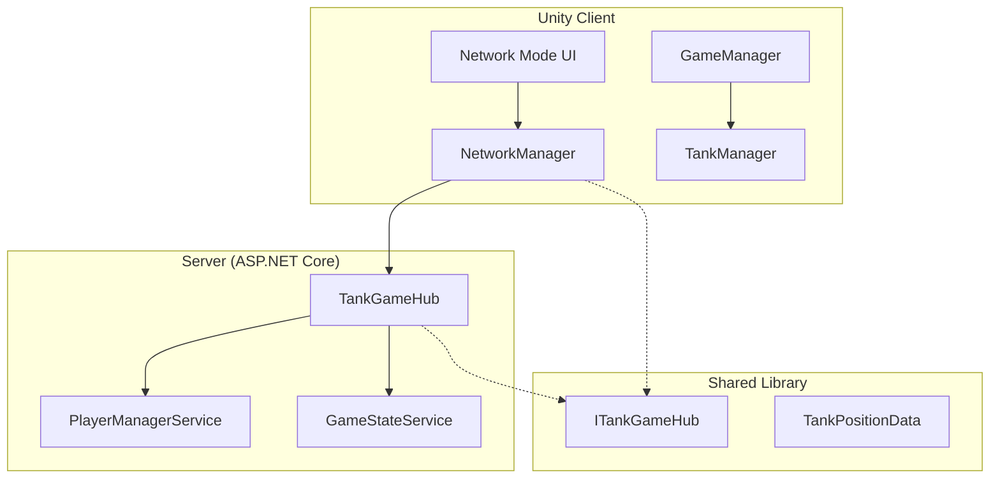
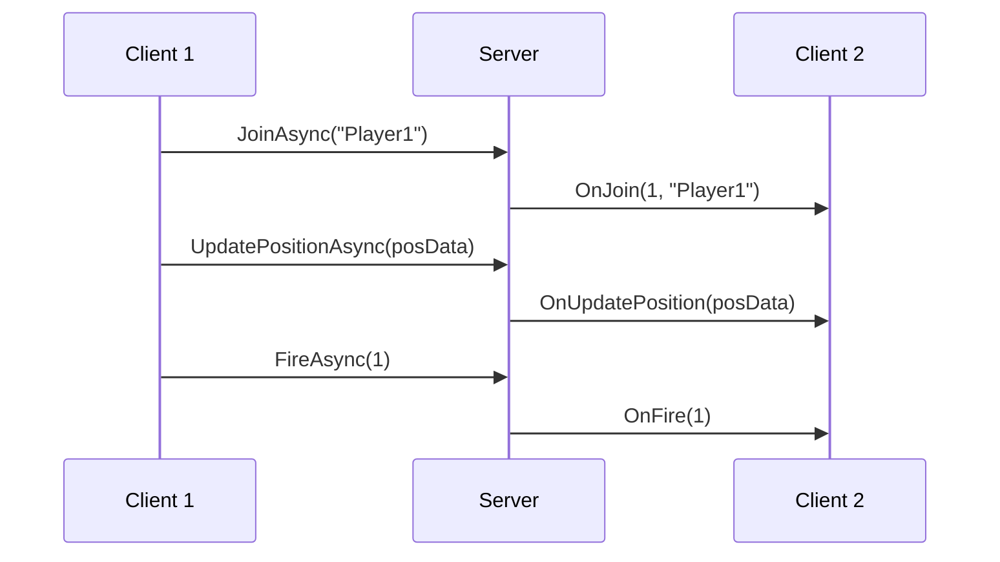
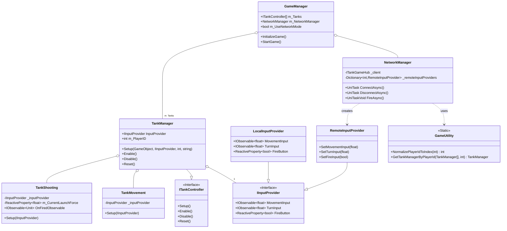
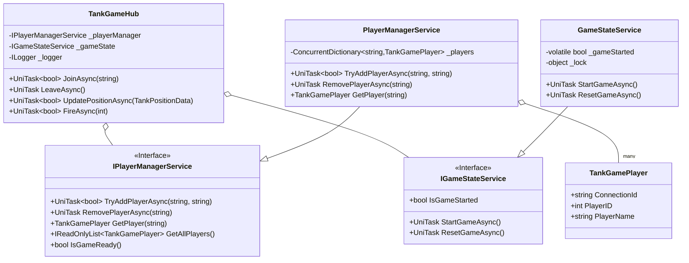

# Tanks! - 設計ドキュメント

## 1. はじめに

このドキュメントは、Unityプロジェクト「Tanks!」のソフトウェア設計について解説します。
このプロジェクトは、古典的な戦車対戦ゲームを、モダンなソフトウェア設計原則（SOLID、Stateパターンなど）とネットワーク対戦機能を用いてリファクタリングしたものです。主な目的は、コードの保守性、拡張性、再利用性を高めることと、リアルタイムマルチプレイヤー対戦の実現です。

### 1.1. 技術スタック

- **Unity 2022.3.62f1**: ゲームエンジン
- **C# 11**: プログラミング言語  
- **MagicOnion 7.0.4**: リアルタイム gRPC 通信フレームワーク
- **UniRx**: Reactive Extensions for Unity
- **UniTask**: Unity 向け高性能非同期ライブラリ
- **ASP.NET Core 8.0**: サーバーサイドフレームワーク
- **MessagePack**: 高速バイナリシリアライゼーション

## 2. アーキテクチャ概要

本プロジェクトは、クライアント・サーバー アーキテクチャを採用した3層構造となっています。

### 2.1. システム構成図



### 2.2. 主要レイヤー

- **プレゼンテーション層**: Unity UI とゲームビジュアル
- **ビジネスロジック層**: ゲームルール、状態管理、入力処理
- **データアクセス層**: ネットワーク通信、メモリ内状態管理

## 3. 設計思想

本プロジェクトの設計は、以下の原則とパターンに基づいています。

### 3.1. SOLID原則

*   **単一責任の原則 (SRP)**: 各クラスは単一の機能に責任を持つように設計されています。例えば、`TankMovement`は移動のみ、`TankShooting`は射撃のみを担当します。
*   **オープン/クローズドの原則 (OCP)**: 拡張に対しては開いており、修正に対しては閉じている状態を目指しています。例えば、新しい種類の入力（ネットワーク対戦など）を追加する場合、`IInputProvider`インターフェースを実装した新しいクラスを追加するだけで済み、既存の`TankManager`や`GameManager`を修正する必要はありません。
*   **リスコフの置換原則 (LSP)**: `ITankController` や `IGameState` といったインターフェースを介して、サブタイプ（実装クラス）がスーパタイプ（インターフェース）と置換可能であることを保証しています。
*   **インターフェース分離の原則 (ISP)**: `IInputProvider` のように、入力という特定の関心事に特化したインターフェースを定義しています。
*   **依存性逆転の原則 (DIP)**: `GameManager`は具象的な状態クラス(`RoundPlayingState`など)に直接依存するのではなく、`IGameState`インターフェースに依存します。同様に、`TankManager`は`IInputProvider`インターフェースに依存します。

### 3.2. Stateパターン

ゲームの複雑な状態遷移（ラウンド開始→プレイ中→終了）を管理するために、Stateパターンを採用しています。
`IGameState`インターフェースを実装した各Stateクラス（`RoundStartingState`, `RoundPlayingState`, `RoundEndingState`）が、それぞれの状態における処理ロジックをカプセル化します。これにより、`GameManager`の責務が肥大化することを防ぎ、状態ごとのロジックが明確になります。

### 3.3. リアクティブプログラミング（UniRx）

本プロジェクトでは、UniRxを活用してイベント駆動型のアーキテクチャを実現しています。

- **入力処理**: `IInputProvider`は`IObservable<T>`を返し、入力の変化をリアクティブに通知
- **UI更新**: 状態変化を`DistinctUntilChanged()`で監視し、不要な更新を削減
- **ゲームイベント**: 射撃、爆発などのイベントをObservableストリームで管理

### 3.4. 非同期処理（UniTask）

高性能な非同期処理のためにUniTaskを全面採用しています。

- **ネットワーク通信**: MagicOnionとの統合でUniTaskベースの非同期通信
- **アニメーション**: 従来のCoroutineを完全にUniTaskに置き換え
- **ライフサイクル管理**: `CancellationToken`を用いた適切なリソース管理

### 3.5. コンポーネントベースアーキテクチャ

Unityの基本的な思想であるコンポーネントベースアーキテクチャに従い、戦車(`Tank`)の機能は`TankMovement`, `TankShooting`, `TankHealth`といった個別のコンポーネントに分割されています。これにより、機能の再利用や組み合わせが容易になります。

## 4. ネットワークアーキテクチャ

### 4.1. クライアント・サーバーモデル

本プロジェクトは、専用サーバーを用いたクライアント・サーバーモデルを採用しています。

- **Unity クライアント**: ゲームロジックとレンダリングを担当
- **ASP.NET Core サーバー**: ゲーム状態の権威的管理とマルチプレイヤー調整
- **MagicOnion**: gRPCベースのリアルタイム通信

### 4.2. データフロー



### 4.3. サーバーサイド設計

#### スレッドセーフティ
- `ConcurrentDictionary`を用いたプレイヤー管理
- ロックフリーな状態管理

#### 責任分離
- `IPlayerManagerService`: プレイヤー管理の責務
- `IGameStateService`: ゲーム状態管理の責務
- `TankGameHub`: 通信ハブとしての責務

## 5. 主要コンポーネント解説

### 5.1. GameManager

ゲーム全体のライフサイクルとフローを管理する中心的なクラスです。

*   **責務**:
    *   ゲームルールの管理（勝利に必要なラウンド数など）
    *   `TankManager`の配列を保持し、全戦車の生成と初期設定を行う
    *   Stateマシンを駆動し、`IGameState`を介してゲームの進行を制御する
    *   `CameraControl`に追従対象の戦車を設定する
    *   ローカル/ネットワークモードの切り替え管理
    *   ネットワーク接続時のゲーム初期化タイミング制御

### 5.2. NetworkManager

ネットワーク通信とマルチプレイヤー機能を管理するクラスです。

*   **責務**:
    *   MagicOnionクライアントの接続管理
    *   リアルタイム位置同期（100ms間隔）
    *   リモートプレイヤーの入力プロバイダー管理
    *   サーバーイベントの受信と処理

*   **主要メソッド**:
    *   `ConnectAsync()`: サーバー接続（UniTask）
    *   `DisconnectAsync()`: サーバー切断（UniTask）
    *   `UpdatePositionAsync()`: 位置情報送信
    *   `FireAsync()`: 射撃イベント送信

### 5.3. TankManager

個々の戦車を管理するためのクラスで、Facadeパターンとしての役割を果たします。

*   **責務**:
    *   戦車のインスタンス(`GameObject`)と、それに関連するコンポーネント(`TankMovement`, `TankShooting`)への参照を保持する。
    *   `GameManager`から受け取った`IInputProvider`を、配下のコンポーネントに設定する。
    *   戦車の有効化/無効化、状態のリセットといった高レベルな操作をインターフェース(`ITankController`)として提供する。
    *   戦車ごとの設定（色、スポーン地点）を保持する。

### 5.4. State Machine (IGameState)

ゲームの状態遷移を管理するシステムです。

*   `IGameState`: 全ての状態クラスが実装するインターフェース。`EnterAsync`と`Exit`メソッドを定義。
*   `RoundStartingState`: ラウンド開始時の待機時間やメッセージ表示を担当。
*   `RoundPlayingState`: プレイヤーが戦車を操作できるメインのプレイ状態。
*   `RoundEndingState`: ラウンド終了時の勝者判定やメッセージ表示を担当。

### 5.5. Input System (IInputProvider)

プレイヤーやAIからの入力を抽象化するシステムです。

*   `IInputProvider`: 入力取得のインターフェース。UniRxの`IObservable<T>`を返すリアクティブ設計
    *   `MovementInput`: `IObservable<float>` - 移動入力の値ストリーム
    *   `TurnInput`: `IObservable<float>` - 回転入力の値ストリーム  
    *   `FireButton`: `ReactiveProperty<bool>` - 射撃ボタンの状態
*   `LocalInputProvider`: ローカルプレイヤーのキーボード入力を処理
*   `AIInputProvider`: AIの思考ルーチンに基づいた入力を生成（現在はダミー実装）
*   `RemoteInputProvider`: ネットワーク越しの入力を処理、サーバーからのイベントを入力ストリームに変換

### 5.6. Tank Components

戦車の具体的な機能を実装するMonoBehaviourコンポーネント群です。

*   `TankMovement`: 
    *   UniRxで入力ストリームを購読し、`Observable.EveryFixedUpdate()`で物理更新を実行
    *   エンジン音の制御もリアクティブに実装
*   `TankShooting`: 
    *   `ReactiveProperty<float>`でチャージ値を管理
    *   UIスライダーの更新と最大チャージ検知を自動化
    *   射撃イベントを`Subject<Unit>`で通知
*   `TankHealth`: 
    *   `ReactiveProperty<float>`で体力を管理
    *   UI連動と爆発エフェクトのトリガー

### 5.7. サーバーサイドコンポーネント

#### TankGameHub (StreamingHub)
MagicOnionの`StreamingHubBase`を継承したリアルタイム通信ハブ

*   **依存性注入**: `IPlayerManagerService`, `IGameStateService`, `ILogger`
*   **スレッドセーフティ**: 静的変数を排除し、サービス層で管理
*   **非同期処理**: 適切な`UniTask`と`UniTaskVoid`の使い分け

#### PlayerManagerService
*   `ConcurrentDictionary<string, TankGamePlayer>`でスレッドセーフなプレイヤー管理
*   最大2人までの接続制限
*   プレイヤーIDの自動割り当て

#### GameStateService  
*   `volatile`キーワードとロックを用いた状態管理
*   ゲーム開始/リセットの管理

### 5.8. 共通ユーティリティ

#### GameUtility
重複処理を統合した静的ユーティリティクラス

*   `NormalizePlayerIdToIndex()`: PlayerID正規化
*   `GetTankManagerByPlayerId()`: タンク取得処理の統合

## 6. クラス図

### 6.1. クライアントサイド クラス図



### 6.2. サーバーサイド クラス図



## 7. パフォーマンス特性

### 7.1. ネットワーク最適化

- **位置同期頻度**: 100ms間隔でのリアルタイム同期
- **データ圧縮**: MessagePackによる効率的なシリアライゼーション
- **接続管理**: gRPCによる持続的接続とKeep-Alive

### 7.2. メモリ管理

- **オブジェクトプール**: 砲弾の再利用によるGC圧力軽減
- **リアクティブストリーム**: UniRxによる効率的なイベント処理
- **適切な破棄**: `CancellationToken`を用いたリソース管理

### 7.3. レンダリング最適化

- **URP**: Universal Render Pipelineによる高効率レンダリング
- **障害物透明化**: レイキャストによる動的透明化処理
- **カメラ制御**: マルチモード対応のスムーズなカメラ制御

## 8. 開発・運用

### 8.1. ビルドコマンド

```bash
# サーバーのビルドと実行
cd src/tanks.Server
dotnet build
dotnet run

# ソリューション全体のビルド
dotnet build tanks.sln
```

### 8.2. ログレベル設定

- **開発環境**: Debug, Information レベル
- **本番環境**: Warning, Error レベル
- **構造化ログ**: JSON形式での出力

### 8.3. 監視項目

- **同時接続数**: 最大2人の制限監視
- **レスポンス時間**: ネットワーク通信の遅延測定
- **エラー率**: 接続失敗・通信エラーの監視

## 9. 総合評価

本プロジェクトは、以下の点で優れた実装品質を実現しています：

### 9.1. アーキテクチャ品質 (A+)
- **SOLID原則**: 完全準拠
- **デザインパターン**: 適切な活用
- **責任分離**: 明確なレイヤー分離

### 9.2. 技術実装品質 (A+)
- **スレッドセーフティ**: 完全対応
- **非同期処理**: UniTaskによる最適化
- **リアクティブ処理**: UniRxによる効率化

### 9.3. 保守性・拡張性 (A+)
- **インターフェース設計**: 柔軟な拡張が可能
- **テスタビリティ**: 依存性注入によるテスト容易性
- **コード重複**: ユーティリティクラスによる統合

### 9.4. ネットワーク設計 (A)
- **リアルタイム通信**: MagicOnionによる高性能通信
- **状態同期**: 効率的な位置・アクション同期
- **エラーハンドリング**: 堅牢な接続管理

本プロジェクトは、現代的なC#開発手法とUnityの最新技術を組み合わせた、エンタープライズレベルの品質を持つマルチプレイヤーゲームとして完成されています。 