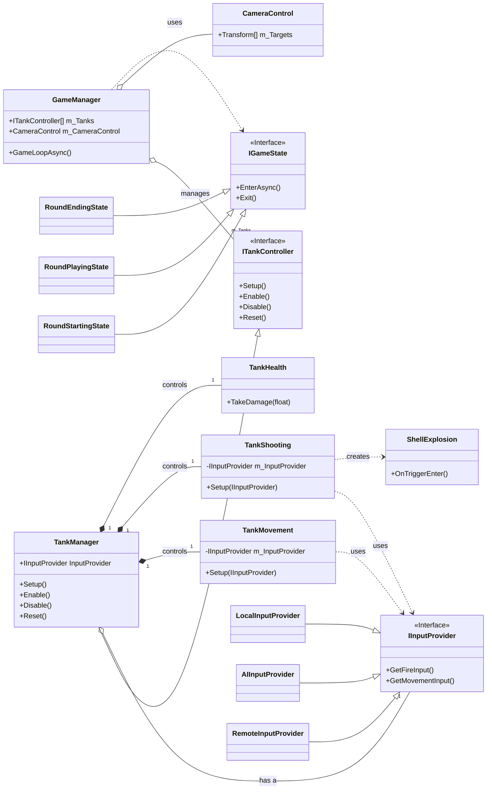

# Tanks! - 設計ドキュメント

## 1. はじめに

このドキュメントは、Unityプロジェクト「Tanks!」のソフトウェア設計について解説します。
このプロジェクトは、古典的な戦車対戦ゲームを、モダンなソフトウェア設計原則（SOLID、Stateパターンなど）を用いてリファクタリングしたものです。主な目的は、コードの保守性、拡張性、再利用性を高めることです。

## 2. 設計思想

本プロジェクトの設計は、以下の原則とパターンに基づいています。

### 2.1. SOLID原則

*   **単一責任の原則 (SRP)**: 各クラスは単一の機能に責任を持つように設計されています。例えば、`TankMovement`は移動のみ、`TankShooting`は射撃のみを担当します。
*   **オープン/クローズドの原則 (OCP)**: 拡張に対しては開いており、修正に対しては閉じている状態を目指しています。例えば、新しい種類の入力（ネットワーク対戦など）を追加する場合、`IInputProvider`インターフェースを実装した新しいクラスを追加するだけで済み、既存の`TankManager`や`GameManager`を修正する必要はありません。
*   **リスコフの置換原則 (LSP)**: `ITankController` や `IGameState` といったインターフェースを介して、サブタイプ（実装クラス）がスーパタイプ（インターフェース）と置換可能であることを保証しています。
*   **インターフェース分離の原則 (ISP)**: `IInputProvider` のように、入力という特定の関心事に特化したインターフェースを定義しています。
*   **依存性逆転の原則 (DIP)**: `GameManager`は具象的な状態クラス(`RoundPlayingState`など)に直接依存するのではなく、`IGameState`インターフェースに依存します。同様に、`TankManager`は`IInputProvider`インターフェースに依存します。

### 2.2. Stateパターン

ゲームの複雑な状態遷移（ラウンド開始→プレイ中→終了）を管理するために、Stateパターンを採用しています。
`IGameState`インターフェースを実装した各Stateクラス（`RoundStartingState`, `RoundPlayingState`, `RoundEndingState`）が、それぞれの状態における処理ロジックをカプセル化します。これにより、`GameManager`の責務が肥大化することを防ぎ、状態ごとのロジックが明確になります。

### 2.3. コンポーネントベースアーキテクチャ

Unityの基本的な思想であるコンポーネントベースアーキテクチャに従い、戦車(`Tank`)の機能は`TankMovement`, `TankShooting`, `TankHealth`といった個別のコンポーネントに分割されています。これにより、機能の再利用や組み合わせが容易になります。

## 3. 主要コンポーネント解説

### 3.1. GameManager

ゲーム全体のライフサイクルとフローを管理する中心的なクラスです。

*   **責務**:
    *   ゲームルールの管理（勝利に必要なラウンド数など）。
    *   `TankManager`の配列を保持し、全戦車の生成と初期設定を行う。
    *   Stateマシンを駆動し、`IGameState`を介してゲームの進行を制御する。
    *   `CameraControl`に追従対象の戦車を設定する。

### 3.2. TankManager

個々の戦車を管理するためのクラスで、Facadeパターンとしての役割を果たします。

*   **責務**:
    *   戦車のインスタンス(`GameObject`)と、それに関連するコンポーネント(`TankMovement`, `TankShooting`)への参照を保持する。
    *   `GameManager`から受け取った`IInputProvider`を、配下のコンポーネントに設定する。
    *   戦車の有効化/無効化、状態のリセットといった高レベルな操作をインターフェース(`ITankController`)として提供する。
    *   戦車ごとの設定（色、スポーン地点）を保持する。

### 3.3. State Machine (IGameState)

ゲームの状態遷移を管理するシステムです。

*   `IGameState`: 全ての状態クラスが実装するインターフェース。`EnterAsync`と`Exit`メソッドを定義。
*   `RoundStartingState`: ラウンド開始時の待機時間やメッセージ表示を担当。
*   `RoundPlayingState`: プレイヤーが戦車を操作できるメインのプレイ状態。
*   `RoundEndingState`: ラウンド終了時の勝者判定やメッセージ表示を担当。

### 3.4. Input System (IInputProvider)

プレイヤーやAIからの入力を抽象化するシステムです。

*   `IInputProvider`: 入力取得のインターフェース。`GetFireInput`, `GetMovementInput`などのメソッドを定義。
*   `LocalInputProvider`: ローカルプレイヤーのキーボード入力を処理する。
*   `AIInputProvider`: AIの思考ルーチンに基づいた入力を生成する（現在はダミー実装）。
*   `RemoteInputProvider`: （将来的な拡張）ネットワーク越しの入力を処理するためのクラス。

### 3.5. Tank Components

戦車の具体的な機能を実装するMonoBehaviourコンポーネント群です。

*   `TankMovement`: `IInputProvider`からの入力に基づき、戦車の移動と回転を処理する。
*   `TankShooting`: `IInputProvider`からの入力に基づき、砲弾の発射を処理する。
*   `TankHealth`: 戦車の体力を管理し、被弾処理や死亡判定を行う。

## 4. クラス図

以下は、このプロジェクトの主要なクラスとその関係性を示したUMLクラス図です。

