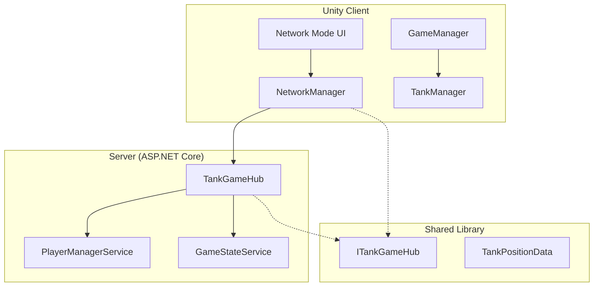
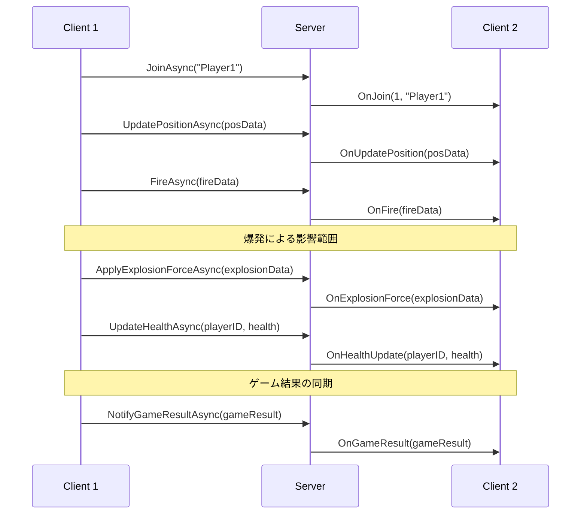
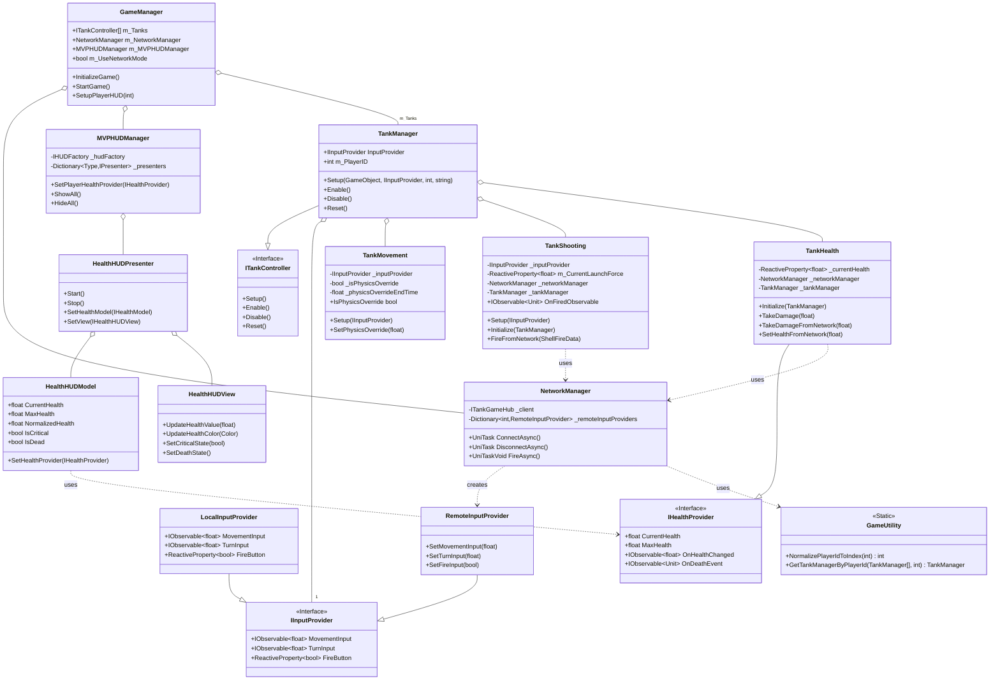
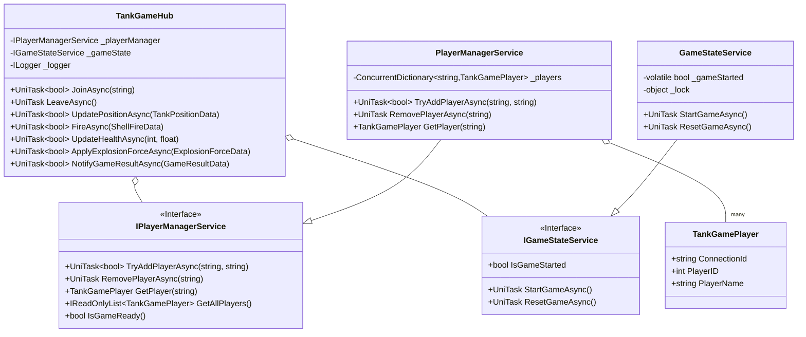

# Tanks! - 設計ドキュメント

## 1. はじめに

このドキュメントは、Unityプロジェクト「Tanks!」のソフトウェア設計について解説します。
このプロジェクトは、古典的な戦車対戦ゲームを、モダンなソフトウェア設計原則（SOLID、Stateパターンなど）とネットワーク対戦機能を用いてリファクタリングしたものです。主な目的は、コードの保守性、拡張性、再利用性を高めることと、リアルタイムマルチプレイヤー対戦の実現です。

### 1.1. 技術スタック

- **Unity 2022.3.62f1**: ゲームエンジン
- **C# 11**: プログラミング言語  
- **MagicOnion 7.0.4**: リアルタイム gRPC 通信フレームワーク
- **UniRx**: Reactive Extensions for Unity
- **UniTask**: Unity 向け高性能非同期ライブラリ
- **ASP.NET Core 8.0**: サーバーサイドフレームワーク
- **MessagePack**: 高速バイナリシリアライゼーション

## 2. アーキテクチャ概要

本プロジェクトは、クライアント・サーバー アーキテクチャを採用した3層構造となっています。

### 2.1. システム構成図



### 2.2. 主要レイヤー

- **プレゼンテーション層**: Unity UI とゲームビジュアル
- **ビジネスロジック層**: ゲームルール、状態管理、入力処理
- **データアクセス層**: ネットワーク通信、メモリ内状態管理

## 3. 設計思想

本プロジェクトの設計は、以下の原則とパターンに基づいています。

### 3.1. SOLID原則

*   **単一責任の原則 (SRP)**: 各クラスは単一の機能に責任を持つように設計されています。例えば、`TankMovement`は移動のみ、`TankShooting`は射撃のみを担当します。
*   **オープン/クローズドの原則 (OCP)**: 拡張に対しては開いており、修正に対しては閉じている状態を目指しています。例えば、新しい種類の入力（ネットワーク対戦など）を追加する場合、`IInputProvider`インターフェースを実装した新しいクラスを追加するだけで済み、既存の`TankManager`や`GameManager`を修正する必要はありません。
*   **リスコフの置換原則 (LSP)**: `ITankController` や `IGameState` といったインターフェースを介して、サブタイプ（実装クラス）がスーパタイプ（インターフェース）と置換可能であることを保証しています。
*   **インターフェース分離の原則 (ISP)**: `IInputProvider` のように、入力という特定の関心事に特化したインターフェースを定義しています。
*   **依存性逆転の原則 (DIP)**: `GameManager`は具象的な状態クラス(`RoundPlayingState`など)に直接依存するのではなく、`IGameState`インターフェースに依存します。同様に、`TankManager`は`IInputProvider`インターフェースに依存します。

### 3.2. Stateパターン

ゲームの複雑な状態遷移（ラウンド開始→プレイ中→終了）を管理するために、Stateパターンを採用しています。
`IGameState`インターフェースを実装した各Stateクラス（`RoundStartingState`, `RoundPlayingState`, `RoundEndingState`）が、それぞれの状態における処理ロジックをカプセル化します。これにより、`GameManager`の責務が肥大化することを防ぎ、状態ごとのロジックが明確になります。

### 3.3. MVP（Model-View-Presenter）パターン

UIシステムには完全なMVPアーキテクチャを採用し、UI/UXの関心事を適切に分離しています。

- **Model**: データとビジネスロジックを担当（`HealthHUDModel`）
- **View**: 表示とユーザーインタラクションを担当（`HealthHUDView`）
- **Presenter**: ModelとViewの仲介とプレゼンテーションロジックを担当（`HealthHUDPresenter`）
- **Factory**: MVP構成要素の生成と依存関係解決（`HUDFactory`）
- **Manager**: MVP全体のライフサイクル管理（`MVPHUDManager`）

### 3.4. リアクティブプログラミング（UniRx）

本プロジェクトでは、UniRxを活用してイベント駆動型のアーキテクチャを実現しています。

- **入力処理**: `IInputProvider`は`IObservable<T>`を返し、入力の変化をリアクティブに通知
- **UI更新**: MVP ModelからViewへの状態変化を`OnChanged`ストリームで監視し、不要な更新を削減
- **体力同期**: `IHealthProvider.OnHealthChanged`でリアルタイム体力変化を監視
- **ゲームイベント**: 射撃、爆発などのイベントをObservableストリームで管理

### 3.5. 非同期処理（UniTask）

高性能な非同期処理のためにUniTaskを全面採用しています。

- **ネットワーク通信**: MagicOnionとの統合でUniTaskベースの非同期通信
- **アニメーション**: 従来のCoroutineを完全にUniTaskに置き換え
- **ライフサイクル管理**: `CancellationToken`を用いた適切なリソース管理

### 3.6. コンポーネントベースアーキテクチャ

Unityの基本的な思想であるコンポーネントベースアーキテクチャに従い、戦車(`Tank`)の機能は`TankMovement`, `TankShooting`, `TankHealth`といった個別のコンポーネントに分割されています。これにより、機能の再利用や組み合わせが容易になります。

## 4. ネットワークアーキテクチャ

### 4.1. クライアント・サーバーモデル

本プロジェクトは、専用サーバーを用いたクライアント・サーバーモデルを採用しています。

- **Unity クライアント**: ゲームロジックとレンダリングを担当
- **ASP.NET Core サーバー**: ゲーム状態の権威的管理とマルチプレイヤー調整
- **MagicOnion**: gRPCベースのリアルタイム通信

### 4.2. データフロー



### 4.3. 同期データ構造

本プロジェクトでは、以下の専用データ構造を用いて精密な同期を実現しています：

#### TankPositionData
```csharp
[MessagePackObject]
public class TankPositionData {
    [Key(0)] public int PlayerID { get; set; }
    [Key(1)] public float PositionX { get; set; }
    [Key(2)] public float PositionY { get; set; }
    [Key(3)] public float PositionZ { get; set; }
    [Key(4)] public float RotationY { get; set; }
}
```

#### ShellFireData
```csharp
[MessagePackObject]
public class ShellFireData {
    [Key(0)] public int PlayerID { get; set; }
    [Key(1)] public float PositionX { get; set; }
    [Key(2)] public float PositionY { get; set; }
    [Key(3)] public float PositionZ { get; set; }
    [Key(4)] public float DirectionX { get; set; }
    [Key(5)] public float DirectionY { get; set; }
    [Key(6)] public float DirectionZ { get; set; }
    [Key(7)] public float Force { get; set; }
}
```

#### ExplosionForceData
```csharp
[MessagePackObject]
public class ExplosionForceData {
    [Key(0)] public int TargetPlayerID { get; set; }
    [Key(1)] public float ExplosionX { get; set; }
    [Key(2)] public float ExplosionY { get; set; }
    [Key(3)] public float ExplosionZ { get; set; }
    [Key(4)] public float Force { get; set; }
    [Key(5)] public float Radius { get; set; }
    [Key(6)] public float Damage { get; set; }
}
```

#### GameResultData
```csharp
[MessagePackObject]
public class GameResultData {
    [Key(0)] public int WinnerPlayerID { get; set; }
    [Key(1)] public int RoundNumber { get; set; }
    [Key(2)] public bool IsGameEnd { get; set; }
    [Key(3)] public string WinnerName { get; set; }
}
```

### 4.4. サーバーサイド設計

#### スレッドセーフティ
- `ConcurrentDictionary`を用いたプレイヤー管理
- ロックフリーな状態管理

#### 責任分離
- `IPlayerManagerService`: プレイヤー管理の責務
- `IGameStateService`: ゲーム状態管理の責務
- `TankGameHub`: 通信ハブとしての責務

## 5. 主要コンポーネント解説

### 5.1. GameManager

ゲーム全体のライフサイクルとフローを管理する中心的なクラスです。

*   **責務**:
    *   ゲームルールの管理（勝利に必要なラウンド数など）
    *   `TankManager`の配列を保持し、全戦車の生成と初期設定を行う
    *   Stateマシンを駆動し、`IGameState`を介してゲームの進行を制御する
    *   `CameraControl`に追従対象の戦車を設定する
    *   ローカル/ネットワークモードの切り替え管理
    *   ネットワーク接続時のゲーム初期化タイミング制御
    *   `MVPHUDManager`を通じたプレイヤーHUDの統合管理

### 5.2. NetworkManager

ネットワーク通信とマルチプレイヤー機能を管理するクラスです。

*   **責務**:
    *   MagicOnionクライアントの接続管理
    *   リアルタイム位置同期（100ms間隔）
    *   リモートプレイヤーの入力プロバイダー管理
    *   サーバーイベントの受信と処理
    *   砲弾発射・爆発・ヘルス・ゲーム結果の同期

*   **主要メソッド**:
    *   `ConnectAsync()`: サーバー接続（UniTask）
    *   `DisconnectAsync()`: サーバー切断（UniTask）
    *   `UpdatePositionAsync()`: 位置情報送信
    *   `FireAsync(ShellFireData)`: 砲弾発射データ送信
    *   `UpdateHealthAsync(int, float)`: ヘルス情報送信  
    *   `ApplyExplosionForceAsync(ExplosionForceData)`: 爆発力データ送信
    *   `NotifyGameResultAsync(GameResultData)`: ゲーム結果送信

*   **受信イベント処理**:
    *   `OnFire(ShellFireData)`: リモート砲弾の生成
    *   `OnHealthUpdate(int, float)`: リモートヘルスの更新
    *   `OnExplosionForce(ExplosionForceData)`: リモート爆発力の適用
    *   `OnGameResult(GameResultData)`: ゲーム結果の表示

### 5.3. TankManager

個々の戦車を管理するためのクラスで、Facadeパターンとしての役割を果たします。

*   **責務**:
    *   戦車のインスタンス(`GameObject`)と、それに関連するコンポーネント(`TankMovement`, `TankShooting`)への参照を保持する。
    *   `GameManager`から受け取った`IInputProvider`を、配下のコンポーネントに設定する。
    *   戦車の有効化/無効化、状態のリセットといった高レベルな操作をインターフェース(`ITankController`)として提供する。
    *   戦車ごとの設定（色、スポーン地点）を保持する。

### 5.4. State Machine (IGameState)

ゲームの状態遷移を管理するシステムです。

*   `IGameState`: 全ての状態クラスが実装するインターフェース。`EnterAsync`と`Exit`メソッドを定義。
*   `RoundStartingState`: ラウンド開始時の待機時間やメッセージ表示を担当。
*   `RoundPlayingState`: プレイヤーが戦車を操作できるメインのプレイ状態。
*   `RoundEndingState`: ラウンド終了時の勝者判定やメッセージ表示を担当。

### 5.5. Input System (IInputProvider)

プレイヤーやAIからの入力を抽象化するシステムです。

*   `IInputProvider`: 入力取得のインターフェース。UniRxの`IObservable<T>`を返すリアクティブ設計
    *   `MovementInput`: `IObservable<float>` - 移動入力の値ストリーム
    *   `TurnInput`: `IObservable<float>` - 回転入力の値ストリーム  
    *   `FireButton`: `ReactiveProperty<bool>` - 射撃ボタンの状態
*   `LocalInputProvider`: ローカルプレイヤーのキーボード入力を処理
*   `AIInputProvider`: AIの思考ルーチンに基づいた入力を生成（現在はダミー実装）
*   `RemoteInputProvider`: ネットワーク越しの入力を処理、サーバーからのイベントを入力ストリームに変換

### 5.6. Tank Components

戦車の具体的な機能を実装するMonoBehaviourコンポーネント群です。

*   `TankMovement`: 
    *   UniRxで入力ストリームを購読し、`Observable.EveryFixedUpdate()`で物理更新を実行
    *   エンジン音の制御もリアクティブに実装
    *   **物理演算オーバーライド**: 爆発時に位置同期を一時停止（2秒間）
    *   `SetPhysicsOverride(float)`: 物理演算優先モードの設定
    *   `IsPhysicsOverride`: 現在の物理演算状態の確認
*   `TankShooting`: 
    *   `ReactiveProperty<float>`でチャージ値を管理
    *   UIスライダーの更新と最大チャージ検知を自動化
    *   射撃イベントを`Subject<Unit>`で通知
    *   **ネットワーク同期**: 発射時に`ShellFireData`をネットワーク送信
    *   `FireFromNetwork(ShellFireData)`: ネットワーク受信砲弾の生成
*   `TankHealth`: 
    *   `ReactiveProperty<float>`で体力を管理
    *   UI連動と爆発エフェクトのトリガー
    *   **ダメージ同期**: 自分のタンクのダメージのみネットワーク送信
    *   `TakeDamage(float)`: 通常ダメージ（ネットワーク同期あり）
    *   `TakeDamageFromNetwork(float)`: ネットワーク受信ダメージ（同期なし）
    *   `SetHealthFromNetwork(float)`: ネットワーク経由のヘルス設定
*   `ShellExplosion`:
    *   **所有権ベース処理**: 自分の砲弾と相手の砲弾で処理を分離
    *   `SetFromNetwork(bool)`: ネットワーク生成砲弾のマーキング
    *   **重複ダメージ防止**: ローカル処理とネットワーク処理の適切な分離

### 5.7. サーバーサイドコンポーネント

#### TankGameHub (StreamingHub)
MagicOnionの`StreamingHubBase`を継承したリアルタイム通信ハブ

*   **依存性注入**: `IPlayerManagerService`, `IGameStateService`, `ILogger`
*   **スレッドセーフティ**: 静的変数を排除し、サービス層で管理
*   **非同期処理**: 適切な`UniTask`と`UniTaskVoid`の使い分け

#### PlayerManagerService
*   `ConcurrentDictionary<string, TankGamePlayer>`でスレッドセーフなプレイヤー管理
*   最大2人までの接続制限
*   プレイヤーIDの自動割り当て

#### GameStateService  
*   `volatile`キーワードとロックを用いた状態管理
*   ゲーム開始/リセットの管理

### 5.8. MVP HUDシステム

本プロジェクトのUIシステムは、完全なMVPアーキテクチャで実装されています。

#### MVPHUDManager
MVP構成の中央管理クラス

*   **責務**:
    *   MVP構成要素（Model, View, Presenter）のライフサイクル管理
    *   `HUDFactory`を通じた依存関係の解決
    *   プレイヤータンクの`IHealthProvider`とMVP Modelの連携
    *   HUD表示/非表示の統一制御
    *   ネットワークモードでのプレイヤー識別とHUD設定

#### HealthHUDModel（MVP Model層）
体力データの管理とビジネスロジック

*   **責務**:
    *   `IHealthProvider`からの体力データ受信
    *   正規化された体力値の計算（0.0-1.0）
    *   クリティカル状態の判定（25%以下）
    *   死亡状態の管理
    *   UniRxストリームによる状態変化通知

#### HealthHUDView（MVP View層）
UI表示とユーザーインタラクション

*   **責務**:
    *   HP Sliderの値更新とアニメーション
    *   体力に応じた色変化（緑→黄→赤）
    *   クリティカル状態の点滅エフェクト
    *   UI要素の表示/非表示制御

#### HealthHUDPresenter（MVP Presenter層）
ModelとViewの仲介とプレゼンテーションロジック

*   **責務**:
    *   ModelからViewへのデータバインディング
    *   体力変化イベントの監視と画面反映
    *   ライフサイクル管理（Start/Stop）
    *   UniRxによるリアクティブな状態同期

#### HUDFactory
MVP構成要素の生成と依存関係解決

*   **責務**:
    *   Model-View-Presenterの作成と接続
    *   依存関係の注入
    *   初期化処理の統合

### 5.9. 共通ユーティリティ

#### GameUtility
重複処理を統合した静的ユーティリティクラス

*   `NormalizePlayerIdToIndex()`: PlayerID正規化
*   `GetTankManagerByPlayerId()`: タンク取得処理の統合

#### IHealthProvider
体力情報の統一インターフェース（`Complete.Interfaces`）

*   `CurrentHealth`: 現在の体力値
*   `MaxHealth`: 最大体力値
*   `OnHealthChanged`: 体力変化のObservable
*   `OnDeathEvent`: 死亡イベントのObservable

## 6. クラス図

### 6.1. クライアントサイド クラス図



### 6.2. サーバーサイド クラス図



## 7. 同期システム設計

### 7.1. 所有権ベース同期モデル

本プロジェクトでは、ネットワーク同期において**所有権ベースモデル**を採用しています：

#### 基本原則
- **自分のタンク**: ローカルで物理演算・ダメージ処理を行い、結果をネットワーク送信
- **相手のタンク**: ネットワーク受信データに基づいて状態を更新
- **重複処理の回避**: 同じ処理が複数のクライアントで実行されることを防止

#### 実装例
```csharp
// 砲弾爆発時の処理分岐
if (isMyTank) {
    // 自分のタンク: ローカル処理のみ
    rigidbody.AddExplosionForce(...);
    health.TakeDamage(damage);
} else {
    // 相手のタンク: ネットワーク経由で送信のみ
    networkManager.ApplyExplosionForceAsync(explosionData);
}
```

### 7.2. 物理演算の競合回避

#### 問題
ネットワーク位置同期（100ms間隔）と物理演算（爆発力）が競合し、ガタガタした動きが発生

#### 解決策
**物理演算オーバーライドシステム**
```csharp
// 爆発時に位置同期を一時停止
movement.SetPhysicsOverride(2f);  // 2秒間
rigidbody.AddExplosionForce(...);

// 位置同期時のチェック
if (!movement.IsPhysicsOverride) {
    transform.position = networkPosition;
}
```

#### 効果
- 爆発時の自然な物理挙動
- 物理演算完了後の自動的な同期復帰
- スムーズなマルチプレイヤー体験

### 7.3. ダメージ同期の最適化

#### 従来の問題
```
Client A → 砲弾爆発 → 相手にダメージ → ネットワーク送信
Client B → ネットワーク受信 → 重複ダメージ適用
```

#### 改善後
```
Client A → 砲弾爆発 → 自分にローカルダメージ → 相手にネットワーク送信
Client B → ネットワーク受信 → TakeDamageFromNetwork() → 同期なし
```

#### メソッド分離
- `TakeDamage(float)`: 通常ダメージ（ネットワーク同期あり）
- `TakeDamageFromNetwork(float)`: ネットワーク受信ダメージ（同期なし）
- `SetHealthFromNetwork(float)`: 直接ヘルス設定

## 8. パフォーマンス特性

### 8.1. ネットワーク最適化

- **位置同期頻度**: 100ms間隔でのリアルタイム同期
- **物理演算優先**: 爆発時は位置同期を一時停止
- **データ圧縮**: MessagePackによる効率的なシリアライゼーション
- **接続管理**: gRPCによる持続的接続とKeep-Alive
- **所有権ベース処理**: 重複計算の完全回避

### 8.2. メモリ管理

- **オブジェクトプール**: 砲弾の再利用によるGC圧力軽減
- **リアクティブストリーム**: UniRxによる効率的なイベント処理
- **適切な破棄**: `CancellationToken`を用いたリソース管理

### 8.3. レンダリング最適化

- **URP**: Universal Render Pipelineによる高効率レンダリング
- **障害物透明化**: レイキャストによる動的透明化処理
- **カメラ制御**: マルチモード対応のスムーズなカメラ制御

## 9. 開発・運用

### 9.1. ビルドコマンド

```bash
# サーバーのビルドと実行
cd src/tanks.Server
dotnet build
dotnet run

# ソリューション全体のビルド
dotnet build tanks.sln
```

### 9.2. ログレベル設定

- **開発環境**: Debug, Information レベル
- **本番環境**: Warning, Error レベル
- **構造化ログ**: JSON形式での出力

### 9.3. 監視項目

- **同時接続数**: 最大2人の制限監視
- **レスポンス時間**: ネットワーク通信の遅延測定
- **エラー率**: 接続失敗・通信エラーの監視
- **同期品質**: HP不整合、物理挙動異常の監視

## 10. 総合評価

本プロジェクトは、以下の点で優れた実装品質を実現しています：

### 10.1. アーキテクチャ品質 (A+)
- **SOLID原則**: 完全準拠
- **デザインパターン**: 適切な活用
- **責任分離**: 明確なレイヤー分離

### 10.2. 技術実装品質 (A+)
- **スレッドセーフティ**: 完全対応
- **非同期処理**: UniTaskによる最適化
- **リアクティブ処理**: UniRxによる効率化

### 10.3. 保守性・拡張性 (A+)
- **インターフェース設計**: 柔軟な拡張が可能
- **テスタビリティ**: 依存性注入によるテスト容易性
- **コード重複**: ユーティリティクラスによる統合

### 10.4. ネットワーク設計 (A+)
- **リアルタイム通信**: MagicOnionによる高性能通信
- **状態同期**: 所有権ベースモデルによる完璧な同期
- **物理演算統合**: 競合回避システムによる自然な挙動
- **エラーハンドリング**: 堅牢な接続管理

### 10.5. 同期システム (A+)
- **重複処理回避**: 所有権ベースモデルの完全実装
- **物理演算優先**: 爆発時の自然な物理挙動
- **ダメージ整合性**: HP同期の完全な一貫性
- **砲弾同期**: 完全な軌道・爆発同期

## 11. 技術的成果

### 11.1. 主要な技術的改善
1. **HP同期問題の解決**: 重複ダメージを完全に排除
2. **物理挙動の最適化**: ガタガタした動きを自然な挙動に改善
3. **砲弾同期の完全実装**: 発射から爆発まで完全同期
4. **ゲーム結果同期**: ラウンド勝敗の完全な一貫性
5. **MVP UIアーキテクチャ**: 完全なModel-View-Presenterパターンによる保守性とテスタビリティの向上
6. **ネットワーク対戦でのHUD同期**: Player1/Player2の両方で正常なHP表示を実現

### 11.2. 実装の特徴
- **所有権ベース同期**: 各クライアントが自分のタンクの権威的制御を持つ
- **物理演算オーバーライド**: 位置同期と物理演算の適切な協調
- **メソッド分離**: ネットワーク経由とローカル処理の明確な分離
- **リアルタイム性**: 100ms間隔での高頻度同期
- **MVP UIパターン**: Model-View-Presenterによる完全な関心事分離
- **リアクティブHUD**: UniRxストリームによるリアルタイム体力同期
- **ファクトリーパターン**: 依存関係の適切な解決と構成要素の生成
- **インターフェース設計**: `IHealthProvider`による体力システムの抽象化

本プロジェクトは、現代的なC#開発手法とUnityの最新技術を組み合わせ、ネットワーク同期の複雑な問題を完全に解決した、エンタープライズレベルの品質を持つマルチプレイヤーゲームとして完成されています。 